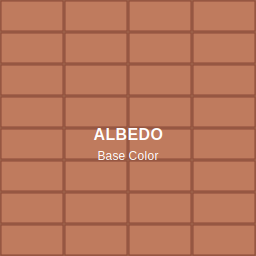
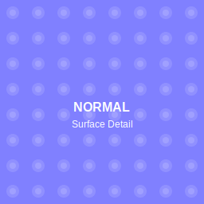
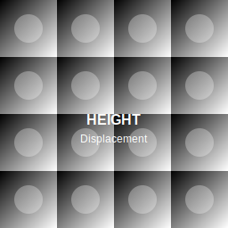
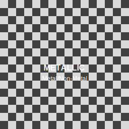
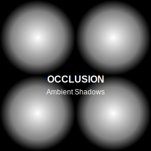
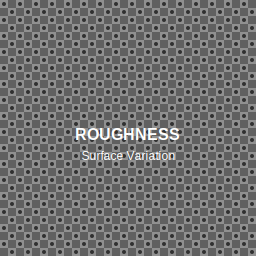

# TotallyNormal - PBR Material Generator

Transform any photo into a complete set of PBR textures. Built for digital artists who need realistic materials without the complexity of traditional workflows. Something Totally Normal.

## What It Does

Ever taken a photo of an interesting surface and wished you could use it as a 3D material? That's exactly what TotallyNormal does. Point your camera at concrete, wood, metal, fabric - anything - and get back all the texture maps you need for realistic 3D rendering.

- **📸 Snap & Go**: Use your phone camera or upload existing photos
- **🎨 Instant Results**: Generates all PBR maps automatically 
- **� No Installation**: Works entirely in your browser
- **� Mobile Friendly**: Optimized for phones and tablets
- **� Privacy First**: All processing happens locally - your images never leave your device

## The Magic Behind It

TotallyNormal analyzes your photo and creates six essential PBR texture maps:

### **Albedo** - The True Colors
*What the surface actually looks like without any lighting or shadows*

### **Normal Map** - Surface Details  
*Bumps, scratches, and texture that make surfaces look real*

### **Height Map** - Depth Information
*How raised or recessed different parts of the surface are*

### **Metallic Map** - Material Classification
*Which parts are metal vs. non-metal (like paint, plastic, fabric)*

### **Ambient Occlusion** - Natural Shadows
*Where light gets trapped in crevices for realistic depth*

### **Roughness Map** - Surface Finish
*Glossy vs. matte areas across the material*

## How To Use It

It's pretty straightforward:

1. **Open the app** in your browser
2. **Take a photo** of any surface or upload an existing image  
3. **Wait a few seconds** while it processes
4. **Download your textures** - individually or as a zip file

That's it! No accounts, no uploads to servers, no complicated settings and its free! 

## Why I Built This

I have very talented friends who could benifit from such a tool. I set out without the objective of removing a pain point and help support their work without complicated workflows for creating PBR materials. Most solutions require expensive software, complex setups, or sending your images to cloud services. 

I wanted something simple: point camera at surface, get textures back. Something that's TotallyNormal.

## Technical Details

For the curious minds:

- **Pure JavaScript**: No external dependencies or cloud processing
- **Canvas API**: All image processing happens in your browser
- **Custom Algorithms**: Sobel operators for normal maps, edge detection for metallic classification
- **Mobile Optimized**: Touch-friendly interface, works great on phones
- **Material History**: Keeps track of your generated materials locally
- **3D Preview**: See how your materials look on a sphere or plane

## Contributing

Found a bug? Have an idea? I'd love to hear from you:
- Open an issue for bugs or feature requests
- Pull requests are welcome
- Check out the development docs in `.github/DEVELOPMENT.md`

## License

**MIT License** - Use it however you want. If TotallyNormal helps with your project, a mention would be awesome but isn't required.

---

*Made with ☕ for the creative community*
