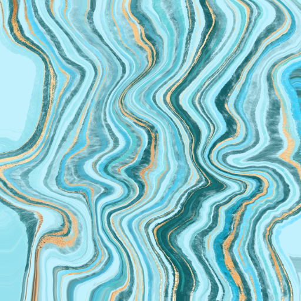
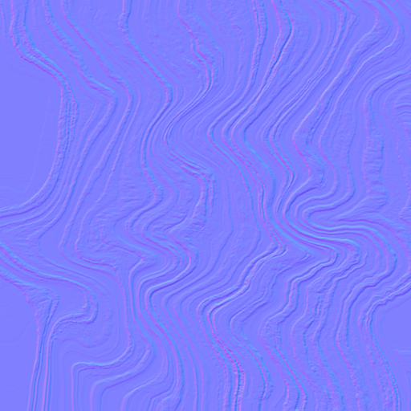
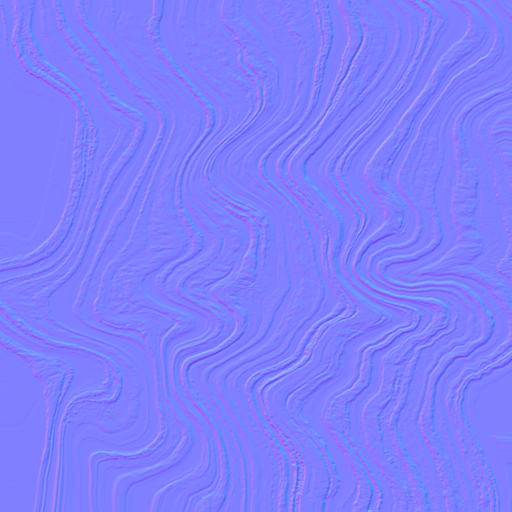
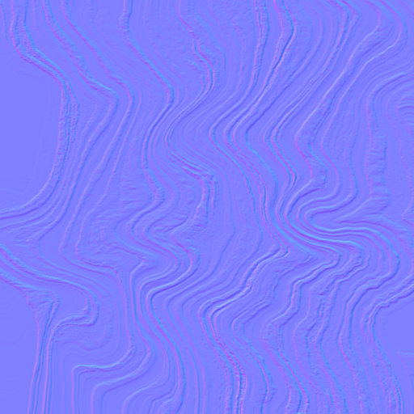
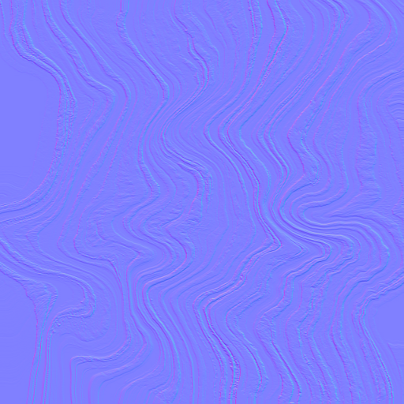
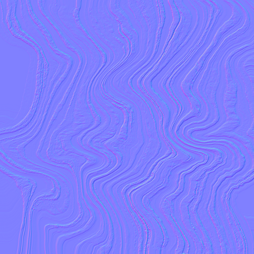

# TotallyNormal - PBR Material Generator
https://tahrit.github.io/TotallyNormal/

Transform any photo into a complete set of PBR textures. Built for digital artists who need realistic materials without the complexity of traditional workflows. Something Totally Normal.

## Demo

Visit the live application to see it in action.

## Key Features

- **Snap & Go**: Use your phone camera or upload existing photos
- **Instant Results**: Generates all PBR maps automatically 
- **No Installation**: Works entirely in your browser
- **Mobile Friendly**: Optimized for phones and tablets with touch controls
- **Privacy First**: All processing happens locally - your images never leave your device
- **3D Preview**: View materials on cube, sphere, or plane with interactive controls
- **Seamless Tiling**: Advanced edge-blending algorithms for tileable textures
- **Material History**: Keeps track of your generated materials locally
- **Keyboard Shortcuts**: Efficient workflow with hotkeys
- **Undo/Redo**: Revert changes to material properties and tiling operations

## The Magic Behind It

TotallyNormal analyzes your photo and creates six essential PBR texture maps:

### Albedo - The True Colors
*What the surface actually looks like without any lighting or shadows*

### Normal Map - Surface Details  
*Bumps, scratches, and texture that make surfaces look real*

### Height Map - Depth Information
*How raised or recessed different parts of the surface are*

### Metallic Map - Material Classification
*Which parts are metal vs. non-metal (like paint, plastic, fabric)*

### Ambient Occlusion - Natural Shadows
*Where light gets trapped in crevices for realistic depth*

### Roughness Map - Surface Finish
*Glossy vs. matte areas across the material*

## Edge Detection Algorithm Comparison

TotallyNormal offers multiple edge detection algorithms for normal map generation. Here's how they compare using the same source material:

### Source Material


*Streamlined mosaic texture used for all algorithm comparisons*

### Algorithm Results

| Algorithm | Normal Map | Characteristics |
|-----------|------------|-----------------|
| **Sobel** |  | Standard edge detection, balanced results |
| **Scharr** |  | Enhanced rotation invariance, more accurate |
| **Prewitt** |  | Simple and fast, uniform edge detection |
| **Roberts** |  | Sharp edges, good for architectural materials |
| **Laplacian** |  | Fine details, emphasizes texture variations |

*Choose the algorithm that best matches your material type for optimal results.*

## How To Use It

It's simple and straightforward:

```
1. Open the app → 2. Choose algorithm → 3. Capture/Upload → 4. Download textures
```

1. **Open the app** in your browser at [tahrit.github.io/TotallyNormal](https://tahrit.github.io/TotallyNormal)
2. **Choose your edge detection algorithm** (Sobel, Scharr, Prewitt, Roberts, or Laplacian)
3. **Take a photo** of any surface or upload an existing image, or load from URL
4. **Wait a few seconds** while it processes using advanced JavaScript algorithms
5. **Preview in 3D** - Rotate and inspect your material on different geometries
6. **Download your textures** - individually or as a complete zip package

That's it! No accounts, no uploads to servers, no complicated settings - and it's completely free! 

## Keyboard Shortcuts

- **Space**: Capture photo (when camera active)
- **Ctrl/Cmd + S**: Download current material
- **Ctrl/Cmd + Z**: Undo last change
- **Ctrl/Cmd + Y** or **Ctrl/Cmd + Shift + Z**: Redo change
- **Escape**: Cancel/Close modals

## Why I Built This

I have very talented friends who could benefit from such a tool. I set out with the objective of removing a pain point and helping support their work by simplifying the complicated workflows for creating PBR materials. Most solutions require expensive software, complex setups, or sending your images to cloud services. 

I wanted something simple: point camera at surface, get textures back. Something that's TotallyNormal.

## Technical Details

For the curious minds:

- **Pure JavaScript**: No external dependencies or cloud processing
- **Canvas API**: All image processing happens in your browser using HTML5 Canvas
- **Multiple Edge Detection Algorithms**: 
  - Sobel operator (standard, balanced)
  - Scharr operator (enhanced rotation invariance)
  - Prewitt operator (simple and fast)
  - Roberts Cross-Gradient (sharp edges)
  - Laplacian (fine details)
- **Advanced PBR Generation**: 
  - Custom luminance-based metallic classification
  - Variance-based roughness calculation
  - Multi-pass ambient occlusion with local contrast
- **Seamless Tiling Algorithm**:
  - Wrap-around edge blending with Gaussian blur
  - Corner averaging for diagonal tiling
  - Configurable blend zones (5-30% of texture size)
- **3D Preview Engine**: 
  - Three.js-powered real-time rendering
  - Interactive orbit controls
  - Multiple geometry options (cube, sphere, plane)
  - Live material property adjustments
- **Mobile Optimized**: Touch-friendly interface with gesture controls
- **Material History**: LocalStorage-based material management (up to 20 items)
- **PWA Support**: Installable as a Progressive Web App with offline capability
- **URL Image Loading**: Support for loading images directly from web URLs
- **Undo/Redo System**: Track and revert changes to material properties

### Performance
- Processing times: 2-4 seconds for 512×512 textures
- Supports resolutions: 256×256, 512×512, 1024×1024
- Client-side processing: No server required
- Memory efficient: Streaming processing for large textures

## Contributing

Found a bug? Have an idea? I'd love to hear from you:
- Open an issue for bugs or feature requests
- Pull requests are welcome
- Check out the development docs in `.github/DEVELOPMENT.md`

## License

**MIT License** - Use it however you want. If TotallyNormal helps with your project, a mention would be awesome but isn't required.

---

## Changelog

### Version 1.6.3 (January 2026)

**UI/UX Improvements**
- Fixed container nesting issue in 3D viewer for cleaner structure
- Added full-screen image zoom overlay - click any texture to enlarge
- Enhanced loading modal with 4-step progress indicator
- Added hover tooltips on texture cards ("Click to enlarge")

**Undo/Redo System**
- Complete history management for material properties (up to 50 actions)
- Tracks changes to roughness, metallic, normal intensity, AO, and displacement
- Saves state before seamless tiling and dynamic tiling operations
- Integrates with blend amount slider adjustments
- Visual feedback with enabled/disabled button states

**Keyboard Shortcuts**
- Space: Capture photo when camera is active
- Ctrl/Cmd + S: Download current material as zip
- Ctrl/Cmd + Z: Undo last change
- Ctrl/Cmd + Y or Ctrl/Cmd + Shift + Z: Redo change
- Escape: Close modals and image zoom overlay

**Seamless Tiling Enhancements**
- Improved Gaussian blur algorithm with proper sigma calculation (radius/2)
- Increased blend zone width to 15% for smoother transitions
- Rewrote edge-to-edge blending algorithm for better wrap-around
- Added corner blending for diagonal tiling perfection
- Fixed pixel-perfect edge matching to eliminate visible seams
- Blend amount slider now properly saves undo states

**3D Viewer Fixes**
- Fixed cube UV mapping to eliminate gaps at edges
- Improved texture wrapping on all geometries
- Better material property synchronization

**Technical Improvements**
- Created UndoRedoManager class for state management
- Improved event handler organization
- Better loading progress feedback during texture generation
- Enhanced modal system with overlay click-to-close
- Service worker version synchronized to 1.6.3

---

*Made with care for the creative community*
