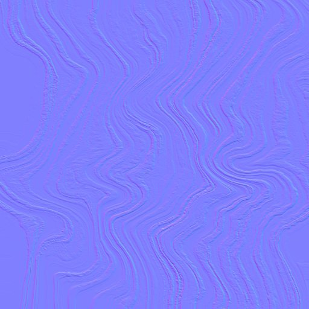

# TotallyNormal - PBR Material Generator
# https://tahrit.github.io/TotallyNormal/
Transform any photo into a complete set of PBR textures. Built for digital artists who need realistic materials without the complexity of traditional workflows. Something Totally Normal.

## What It Does

Ever taken a photo of an interesting surface and wished you could use it as a 3D material? That's exactly what TotallyNormal does. Point your camera at concrete, wood, metal, fabric - anything - and get back all the texture maps you need for realistic 3D rendering.

- **📸 Snap & Go**: Use your phone camera or upload existing photos
- **🎨 Instant Results**: Generates all PBR maps automatically 
- **🌐 No Installation**: Works entirely in your browser
- **📱 Mobile Friendly**: Optimized for phones and tablets with touch controls
- **🔒 Privacy First**: All processing happens locally - your images never leave your device

## The Magic Behind It

TotallyNormal analyzes your photo and creates six essential PBR texture maps:

### **Albedo** - The True Colors
*What the surface actually looks like without any lighting or shadows*

### **Normal Map** - Surface Details  
*Bumps, scratches, and texture that make surfaces look real*

### **Height Map** - Depth Information
*How raised or recessed different parts of the surface are*

### **Metallic Map** - Material Classification
*Which parts are metal vs. non-metal (like paint, plastic, fabric)*

### **Ambient Occlusion** - Natural Shadows
*Where light gets trapped in crevices for realistic depth*

### **Roughness Map** - Surface Finish
*Glossy vs. matte areas across the material*

## Edge Detection Algorithm Comparison

TotallyNormal offers multiple edge detection algorithms for normal map generation. Here's how they compare using the same source material:

### Source Material

*Streamlined mosaic texture used for all algorithm comparisons*

### Algorithm Results

| Algorithm | Normal Map | Characteristics |
|-----------|------------|-----------------|
| **Sobel** |  | Standard edge detection, balanced results |
| **Scharr** |  | Enhanced rotation invariance, more accurate |
| **Prewitt** |  | Simple and fast, uniform edge detection |
| **Roberts** |  | Sharp edges, good for architectural materials |
| **Laplacian** |  | Fine details, emphasizes texture variations |

*Choose the algorithm that best matches your material type for optimal results.*

## How To Use It

It's simple and straightforward:

1. **Open the app** in your browser
2. **Choose your edge detection algorithm** (Sobel, Scharr, Prewitt, Roberts, or Laplacian)
3. **Take a photo** of any surface or upload an existing image, or load from URL
4. **Wait a few seconds** while it processes using advanced JavaScript algorithms
5. **Download your textures** - individually or as a complete zip package

That's it! No accounts, no uploads to servers, no complicated settings - and it's completely free! 

## Why I Built This

I have very talented friends who could benefit from such a tool. I set out with the objective of removing a pain point and helping support their work by simplifying the complicated workflows for creating PBR materials. Most solutions require expensive software, complex setups, or sending your images to cloud services. 

I wanted something simple: point camera at surface, get textures back. Something that's TotallyNormal.

## Technical Details

For the curious minds:

- **Pure JavaScript**: No external dependencies or cloud processing
- **Canvas API**: All image processing happens in your browser
- **Multiple Edge Detection Algorithms**: Sobel, Scharr, Prewitt, Roberts Cross-Gradient, and Laplacian operators for normal map generation
- **Advanced PBR Generation**: Custom algorithms for metallic classification, roughness calculation, and ambient occlusion
- **Mobile Optimized**: Touch-friendly interface with pinch-to-zoom and drag controls for 3D preview
- **Material History**: Keeps track of your generated materials locally
- **3D Preview**: Real-time PBR material preview on sphere or plane geometry
- **URL Image Loading**: Support for loading images directly from web URLs

## Contributing

Found a bug? Have an idea? I'd love to hear from you:
- Open an issue for bugs or feature requests
- Pull requests are welcome
- Check out the development docs in `.github/DEVELOPMENT.md`

## License

**MIT License** - Use it however you want. If TotallyNormal helps with your project, a mention would be awesome but isn't required.

---

*Made with ☕ for the creative community*
